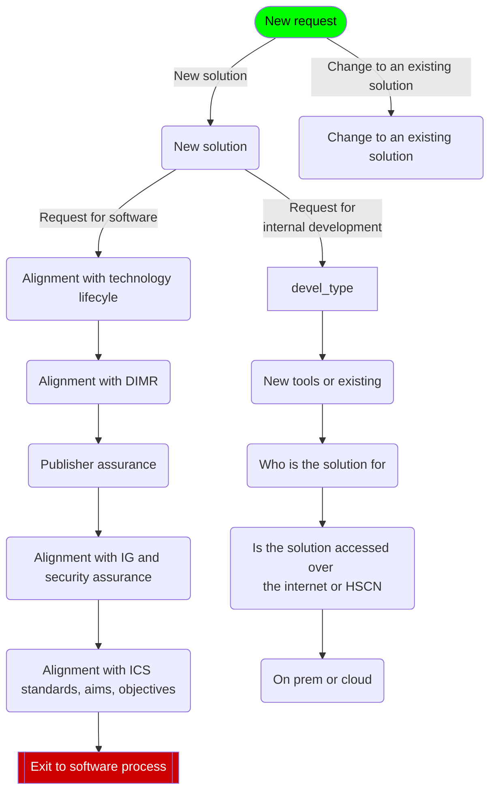

# The solution design process

```mermaid

graph TD;

request -- New solution --> newsolution
request -- Change to an existing solution --> existingsolution

newsolution -- Request for software --> soft_lifecycle 
soft_lifecycle --> soft_dimr --> soft_publisher --> soft_assurance --> soft_ics --> soft_exit

newsolution -- Request for \ninternal development --> devel_type

devel_type --> devel_tools --> devel_audience --> devel_access --> devel_prem

request([New request])
newsolution(New solution)
existingsolution(Change to an existing solution)
soft_dimr(Alignment with DIMR)
soft_publisher(Publisher assurance)
soft_lifecycle(Alignment with technology lifecyle)
soft_assurance(Alignment with IG and security assurance)
soft_ics(Alignment with ICS standards, aims, objectives)
soft_exit[[Exit to software process]]

devel_tools(New tools or existing)
devel_prem(On prem or cloud)
devel_audience(Who is the solution for)
devel_access(Is the solution accessed over \nthe internet or HSCN)

style request fill:#0f0,color:#000
style soft_exit fill:#c00,color:#fff

```