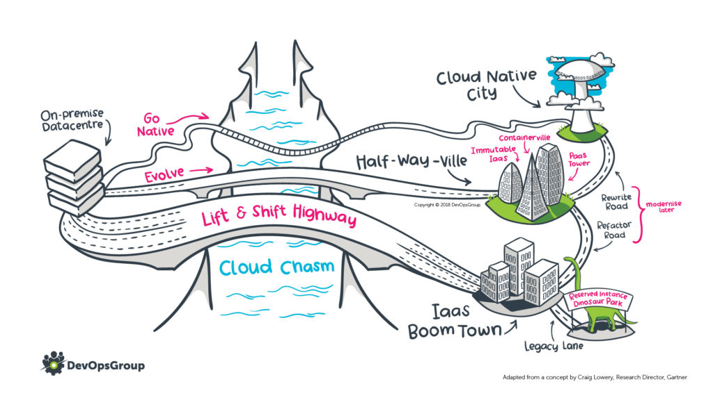

# The solution design process

 

<!-- Initialise a top-down graph -->

```mermaid

graph TD; %% initialise a top-down basic graphic

%% Top level structure
request -- New solution --> newsolution
request -- Change to an existing solution --> existingsolution

%% New software request structure
newsolution -- Request for software --> soft_lifecycle 
soft_lifecycle --> soft_dimr --> soft_publisher --> soft_assurance --> soft_ics --> soft_exit

%% New internal development structure
newsolution -- Request for internal development --> devel_type

devel_type --> devel_tools --> devel_audience --> devel_access --> devel_prem

%% Change to existing solution structure
existingsolution ---> ex_minorormajor
ex_minorormajor -- Minor --> ex_normalchange
ex_minorormajor -- Major --> ex_lifecycle --> ex_sevenrs

%% Common path to workload assessment and return to P&P
devel_prem --> devel_workload
ex_sevenrs ---> devel_workload
devel_workload --> devel_pp

%% Node text labels and shapes
%% ([]) produces a stadium-shaped node
%% () produces a node with round edges (default)
%% [[]] produces a subroutine node
request([New request])
newsolution(New solution)
existingsolution(Change to an existing solution)
soft_dimr(Alignment with DIMR)
soft_publisher(Publisher assurance)
soft_lifecycle(Alignment with technology lifecyle)
soft_assurance(Alignment with IG and security assurance)
soft_ics(Alignment with ICS standards, aims, objectives)
soft_exit[[Exit to software process]]

devel_type(Type of development)
devel_tools(New tools or existing)
devel_prem(On prem or cloud)
devel_audience(Who is the audience)
devel_access(Is the solution accessed over the internet or HSCN)
devel_workload(Workload assessment)
devel_pp[[Return to P&P]]

ex_minorormajor(A minor or major change)
ex_normalchange[[Exit to change control]]
ex_lifecycle(Alignment with technology lifecycle)
ex_sevenrs(7R assessment)

%% Node formatting
style newsolution fill:#27a,color:#fff
style existingsolution fill:#27a,color:#fff
style request fill:#0f0,color:#000
style soft_exit fill:#c00,color:#fff
style ex_normalchange fill:#c00,color:#fff
style devel_pp fill:#c00,color:#fff

```

# Introduction
In the evaluation of new requests for digital solutions, be they commercial off the shelf software or an internally developed application or form of integration, it is from time to time necessary to consider a high-level technical architecture approach at the overall solution level. Such an approach can help ensure that the Trust continues to procure and build high quality, person centred digital services that align with the technology and governance objectives of both the Trust and the wider integrated care system in Dorset.

This flowchart and accompanying text attempts to set out at a high level how such a process might work, and is open for comment and discussion.

# Process

## New requests
New requests shall be referred to the SDG by the separate **pipeline and proposed** meeting, to be classified as a request *for a new solution*, or to *change an existing solution*.

## Requests for new solutions
Requests for new solutions may encompass initial consideration of *requests for new software*, or *requests for internal development*.

### New software

#### Alignment with technology lifecycle
The group must consider whether the requested solution impacts on the technology lifecycle of the Trust and potentially the wider ICS. For example - does the solution have dependencies on old versions of software, or other technologies that organisations are trying to deprecate. Alternatively, can a solution boost the adoption of a nascent technology? The [EASG architecture portfolio](https://nhsdorsetccg.sharepoint.com/sites/NHSDorsetEnterpriseArchitecture/SitePages/CollabHome.aspx) can provide further information on pertinent technologies and products.

##### Lifecyle states

| State | Description|
|-------|------------|
| Preferred | Technology in use, licensing/contract valid, functionality adequate or better, strategic choice |
| Supported | Technology in use by exception, licensing/contract valid, functionality adequate, greater than 2 year from EOL |
| Retire | Technology is planned for retirement, less than 2 year from EOL |
| EOL | Technology is out of contract or vendor mainstream/extended support, deprecated |
| Nascent | Technology is being piloted or phased into production |

#### Alignment with DIMR
Dorset HealthCare publishes a menu of [Digital Minimum Requirements](https://digitaldhc.github.io/digital-minimum-requirements), known as DIMR. An important step in the consideration of new solutions is the selection of pertinent DIMR menu items to either be included in a formal statement of requirements, or to be presented to suppliers as part of the Trust's due diligence processes.

#### Publisher assurance
Dorset HealthCare may ask vendors to demonstrate compliance with either [ISO27001](https://www.iso.org/isoiec-27001-information-security.html) or [Cyber Essentials Plus](https://www.ncsc.gov.uk/cyberessentials/overview), or to evidence their presence on certain public sector commercial frameworks. We may ask vendors to demonstrate further levels of compliance, depending on the circumstances.

#### Alignment with IG and security assurance
The Trust has existing assurance tracks for both information governance and IT security. While these will often be undertaken as part of the [software change process](software-change.md), it is important that assurance colleagues are involved with the activities of a SDG.

#### Alignment with ICS standards, aims, objectives
Dorset HealthCare is a fully engaged and enthusiastic member of the Dorset IM&T community, dedicated to working across organisational boundaries to deliver and run a coherent digital offer for the Dorset integrated care system. In the consideration of new solutions, we have adopted the stance that we will not make any recommendation that knowingly inhibits frictionless working across organisational boundaries between health and social care in Dorset, or introduces a significant new or duplicate technology without explicit agreement obtained through the governance channels of the ICS.

### New internal development

#### Type of development
It is important to consider the user requirements which will help determine the type of development that will be required to deliver a solution. For example, does the solution require a database, a web front end, a background integration and so on.

#### New tools or existing
Is it likely that the solution will make use of existing tools, development environments and the like, or will it require new tools and skills? It is also necessary to consider the alignment of the tools with the technology lifecycle - does a solution require us to prolong the use of a tool we are otherwise looking to deprecate or retire, or provide us with an opportunity to boost adoption of a nascent technology?

#### Who is the audience
Is the solution to be used solely by employed Dorset HealthCare staff, or might it be used by its delivery partners, the wider health and social care community, or by the public? Does this affect the way the solution is built and delivered?

#### Is the solution accessed over the internet or HSCN
NHS Digital architecture principles state that [digital services should be available over the internet by default](https://digital.nhs.uk/developer/nhs-digital-architecture/principles/internet-first). In the evaluation of a new solution, we should consider how this might be delivered and, if we believe an exception exists and the new solution should be available solely from HSCN, the justifications for this. The intention for a solution to be used only internally should not on its own be justification for an exception.

#### On prem or in the cloud
The previous considerations about audience and access method all have the potential to influence whether the solution is provided on premise or in the cloud. While it is straightforward to develop on prem, each new web server and new database creates an additional [attack surface](http://web.archive.org/web/20221208054240/https://cheatsheetseries.owasp.org/cheatsheets/Attack_Surface_Analysis_Cheat_Sheet.html) that must be managed and patched, and consumes finite on-premise resource. NHS Digital architecture principles state that [digital services should be hosted within the public cloud unless there is a clear reason not to do so](https://digital.nhs.uk/developer/nhs-digital-architecture/principles/public-cloud-first). When considering audience we should bear in mind that it is much easier to provision access to cloud-hosted resources from the internet than it is to provide access to on-premise resources. 

## Requests for changes to existing solutions

The first consideration in the evaluation of changes to existing solutions should be whether the group class the change to be minor or major.

### Minor changes
If a request for a change to an existing solution is judged to be minor, it is possibly not necessary for the SDG to consider the request in detail, simply allowing the request to proceed via the normal change control process. SDG members should however reserve the right to consider a minor request for change if it is expedient to do so.

### Major changes
Requests for major or large-scale change to existing digital solutions will ultimately require further consideration within the P&P process - SDG members should consider the best way in which to return a recommendation to the P&P group, bearing in mid that this may change depending on the nature of the request.

Requests for major or large-scale change to existing digital solutions may provide significant opportunities for re-engineering, optimisation or re-provision that improve the technology posture of the organisation and even unlock additional clinical or business benefits.

#### Alignment with technology lifecycle
The group must consider whether changes to a solution impact on the technology lifecycle of the Trust and potentially the wider ICS. For example - does the solution prolong dependencies on old versions of software, or other technologies that organisations are trying to deprecate. Alternatively, can the re-engineering of a solution boost the adoption of a nascent technology? The [EASG architecture portfolio](https://nhsdorsetccg.sharepoint.com/sites/NHSDorsetEnterpriseArchitecture/SitePages/CollabHome.aspx) can provide further information on pertinent technologies and products.

##### Lifecyle states

| State | Description|
|-------|------------|
| Preferred | Technology in use, licensing/contract valid, functionality adequate or better, strategic choice |
| Supported | Technology in use by exception, licensing/contract valid, functionality adequate, greater than 2 year from EOL |
| Retire | Technology is planned for retirement, less than 2 year from EOL |
| EOL | Technology is out of contract or vendor mainstream/extended support, deprecated |
| Nascent | Technology is being piloted or phased into production |

#### 7R assessment
The [7R](https://digital.nhs.uk/services/cloud-centre-of-excellence/cloud-topic-areas/application-migration-and-modernisation) [assessment](https://archive.ph/yZzgW) is an industry standard decision tree used when considering the future of digital solutions. We should aim to consider the 7Rs whenever thinking about major changes to digital solutions.

**Retain** - the do-nothing option, which will keep the solution substantially unaltered and in the same place.

**Retire** - is the solution in question still required? Is its functionality duplicated elsewhere in a more sustainable manner, meaning that an option may exist to retire this solution?

**Re-purchase** (also known as **replace**) - it may be that the overall technical debt within a solution is so great that the best option is to replace it with something else. There may also be significant benefits in replacing a bespoke solution with something that is industry standard.

**Relocate** or **rehost** - could a solution be relocated to the cloud by the simple performance of a "lift-'n'-shift" migration? It should be noted that while this can deliver short-term benefit, it does not take advantage of cloud capabilities and is unlikely to be a substantive solution due to cost. It should be seen as the first step in an eventual **refactoring** of the solution to a cloud-native state. **Relocation** involves deploying the same VMWare hypervisor in the cloud, while **rehosting** would mean using cloud infrastructure-as-a-service (*IaaS*) to create like-for-like virtual servers.

**Re-platform** (also known as **lift-'n'-reshape**) - this will involve migrating a solution to the cloud and introducing some level of cloud optimisation, for example migrating an on-premise Microsoft SQL Server database to [Azure SQL](https://azure.microsoft.com/en-gb/products/azure-sql/database), or [Amazon RDS](https://aws.amazon.com/rds/).

**Refactor** - this is the most complex of the seven Rs, and involves fundamentally re-architecting the solution to take advantage of cloud-native functionality, improving its agility, performance and scalability. Such a refactoring can change the nature of the solution from a monolithic architecture to a collection of coupled microservices that may be swapped out or scaled up or down as required.

The diagram below shows a number of cloud adoption routes, and how the various options relate to each other. The [accompanying web page](https://www.devopsgroup.com/insights/resources/diagrams/all/cloud-migration-pathways/) also sets out a number of opportunities and shortcomings. The diagram is copyright (c) DevOpsGroup.
