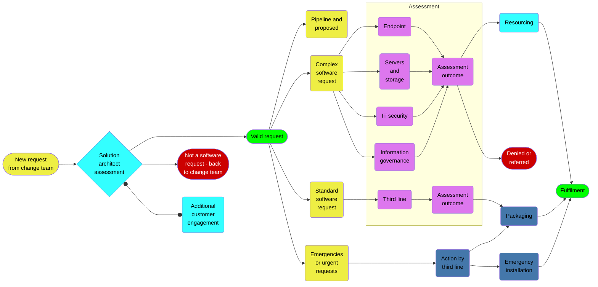

# Software change process

# Introduction
Since launching a formal software request process in the summer of 2020 we have considered a number of modifications to enable us to process and fulfil requests in a proportionate and responsive manner. This document reflects the process in place at the end of 2022.

# Background
The Dorset HealthCare change process involves software change requests being initially classified by the IM&T digital solution architect, before being placed into one of three channels:
* **software requests**, where a piece of software will be assessed by relevant subject matter experts;
* **P&P pipeline**, where more complex requests can be discussed and a plan of action identified;
* **emergencies**, where operationally important requests can be actioned at speed.

This document concerns itself solely with software requests.

# Channels
Once a software request has been determined by the solution architect as being valid, it can proceed through a potential four sub-channels:
* **pipeline and proposed**, where a request can be referred back to the P&P pipeline for consideration;
* **complex software request**, where a request can be subjected to an appropriate level of due diligence by subject matter experts;
* **standard software requests**, where a request for simple or straightforward items of software that do not require SME assessment can be processed;
* **emergency requests** where an urgent operational need exists for a piece of software.

## Complex software requests
The majority of requests for new software proceed via this sub-channel. Requests in the complex channel will be assessed by the following subject matter experts, or their delegates:
* senior engineer EUC;
* senior engineer servers and storage;
* IT security officer;
* Data Protection Officer.

Each subject matter expert will assess the request according to their own criteria. The resourcing of complex requests is carried out by the Head of IT Infrastructure.

## Standard software requests
This sub-channel is for simple or straightforward items of software that do not require a subject matter assessment. This can include (but is not limited to):
* updates (although updates should not by default enter the change process – see separate note);
* internal IM&T software;
* new software that has been assessed by partner organisations;
* software that does not access, use, interpret or write to either patient data or PID.

The decision about which items go in the standard software requests channel will be taken by the IM&T digital solution architect. The channel will be run by the third line team who own the requests from end-to-end. This includes (but is not limited to) liaising with the customer to confirm requirements, appropriate levels of due diligence, and the packaging and deployment of software.

Requests, or matters arising from requests, can be escalated to the IM&T digital solution architect or line managers at any time. If, in the course of their due diligence, the third line team believe a request should be escalated to the complex channel or elsewhere, they can do this by contacting the IM&T digital solution architect.

# Types of software

## Updates, upgrades or extensions to existing software
Where a piece of software is already in use within the Trust, any updates or upgrades that customers ask us to apply should be treated initially as a normal service request, be logged in the Footprints service management system and passed to the third line team. In their carrying out of due diligence against the request, the third line team can assess whether there are any material changes to the software sufficient for it to be considered instead as a change request.

## Software we must deploy
On occasion we will be presented with software where a mandate exists for us to deploy it. If a piece of mandated software has come from one of the Trust’s strategic partners 1 but has not necessarily been well communicated in advance, this can result in requests to the service desk from staff who are either relatively junior or have little ownership over the wider context of our requirement to use the software. In this case a service request should be logged in the Footprints service management system and passed to the third line team with any escalations set as necessary. If, in the course of their due diligence, the third line team believe a request should be escalated to the complex channel or elsewhere, they can do this through discussion with the Head of IT Operations or the IM&T digital solution architect.

Mandated software from strategic partners has inferred approval and should be deployed. In the event of concerns, problems or other issues arising from this the IT department should take ownership of the matter and speak directly with line management or their opposite number colleagues as appropriate.

1 These being Dorset ICB, Dorset County Hospital, University Hospitals Dorset, Yeovil District Hospital and Salisbury District Hospital

## Definitions
UPDATES or UPGRADES mean changes or new releases to software that the Trust already operates that has either been explicitly approved or has ‘grandfather rights’. 

EXTENSIONS mean add-ons that provide new or enhanced functionality to a piece of software.

INTERNAL SOFTWARE means software that is used only within the IT department for the express purpose of supporting the good running of the IM&T service.

EMERGENCIES mean incidents or occurrences whereby their emergency or severity (or a combination thereof) have an adverse impact on a department (or departments) within the Trust to carry out their normal activity.